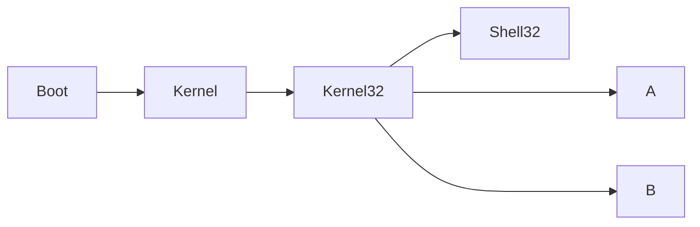
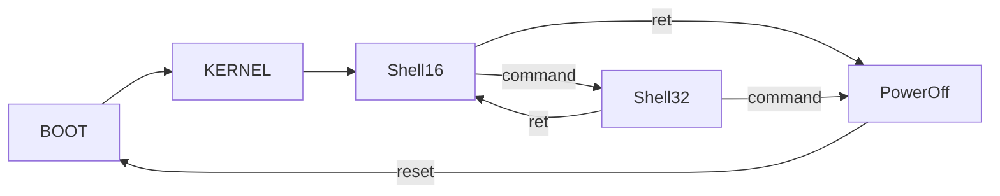

## Memory of developing Mecocoa

- [Q 20240207](https://stackoverflow.com/questions/22983797/is-it-possible-to-link-16-bit-code-and-32-bit-code): **It is possible for a ELF file to contain different BITS of a platform**.
- E 20240207: Based on past experience, flat mode may have an advantage in returning 16 bits because **the segments are not limited by length**(MIN\~MAX).

### Structure

Before 20240206:

After 20240212:

After ...

